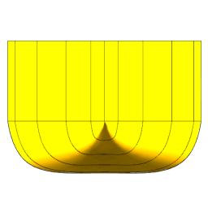

To Do List
==========

ydeos_project
-------------

- Software architecture document
- Docker container

All projects
------------

- Install instructions
- Contributing document
- Architecture document
- Split corelibpy into domain specific repositories (forces, units ...)
- CI (Travis ?)
- Tests coverage
- Automated code quality checks (linting, radon ...)
- More detailed description of contents in README.rst